# WarpScout for Android

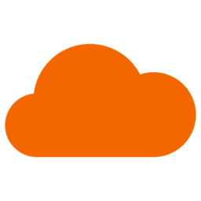

[English version](README.md)

## О проекте

WARPSCOUT for Android представляет собой разрабатываемый нативный Android-интерфейс для регистрации WARP-аккаунта, сканирования адресов, инструментов поиска, экспорта конфигураций и локального SOCKS-сервера.

Сканирование выполняется на Android-устройстве. Аккаунты и результаты не сохраняются на сервере OpenWarpKit.

## Возможности

Цели первого Android-релиза:

- Пресеты Standard, Durable и Full
- WireGuard, AmneziaWG, MASQUE H3 и MASQUE H2
- IPv4, IPv6, фильтры узлов и стран, свои диапазоны, MTU, DNS и проверка скорости
- Поиск AWG junk и I1
- Поиск MASQUE SNI
- Сканирование WARP-in-WARP
- Локальная история сканирований
- Экспорт WireGuard, AmneziaWG, usque, Mihomo, текстового отчёта и лучшего адреса
- SOCKS-сервер только на loopback-интерфейсе
- Русский и английский интерфейс
- Foreground Service с прогрессом и остановкой операции

## Скриншоты

| Регистрация аккаунта | Сканирование |
| --- | --- |
| <picture><source media="(prefers-color-scheme: dark)" srcset="docs/screenshots/dark/onboarding.png"><source media="(prefers-color-scheme: light)" srcset="docs/screenshots/light/onboarding.png">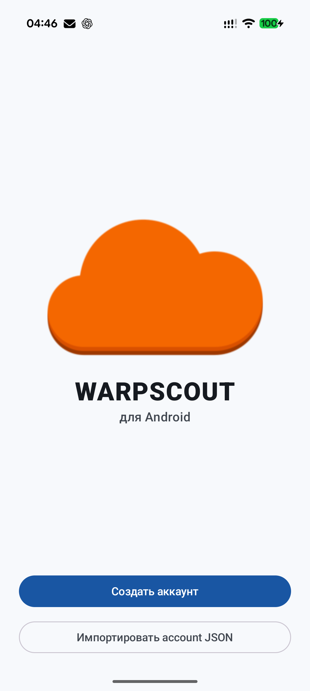</picture> | <picture><source media="(prefers-color-scheme: dark)" srcset="docs/screenshots/dark/scan.png"><source media="(prefers-color-scheme: light)" srcset="docs/screenshots/light/scan.png">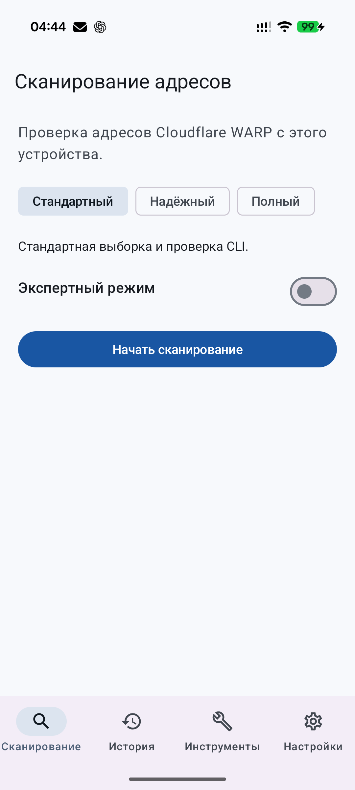</picture> |
| История | Инструменты |
| <picture><source media="(prefers-color-scheme: dark)" srcset="docs/screenshots/dark/history.png"><source media="(prefers-color-scheme: light)" srcset="docs/screenshots/light/history.png">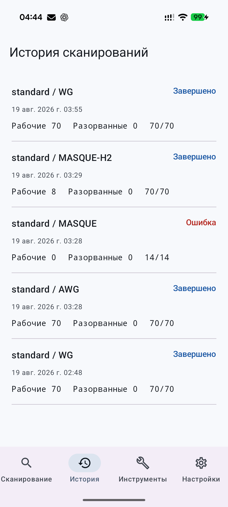</picture> | <picture><source media="(prefers-color-scheme: dark)" srcset="docs/screenshots/dark/tools.png"><source media="(prefers-color-scheme: light)" srcset="docs/screenshots/light/tools.png">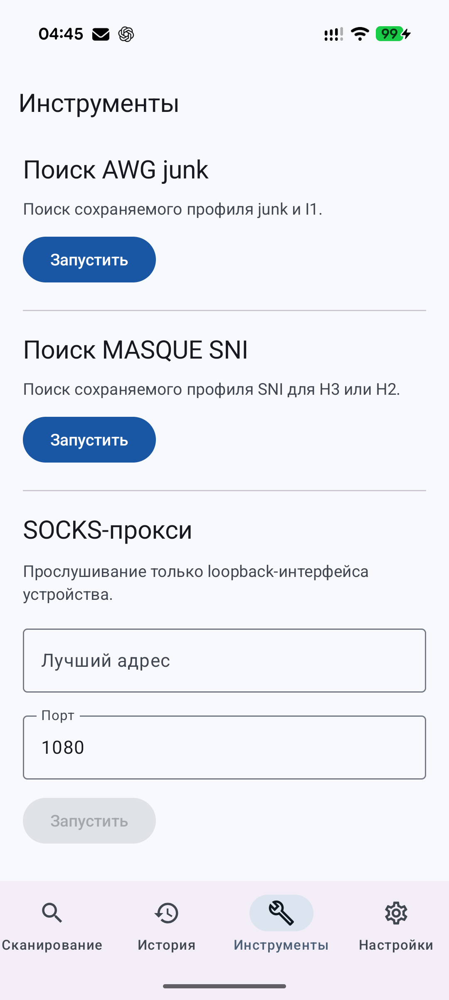</picture> |
| Настройки | Экспертный режим |
| <picture><source media="(prefers-color-scheme: dark)" srcset="docs/screenshots/dark/settings.png"><source media="(prefers-color-scheme: light)" srcset="docs/screenshots/light/settings.png">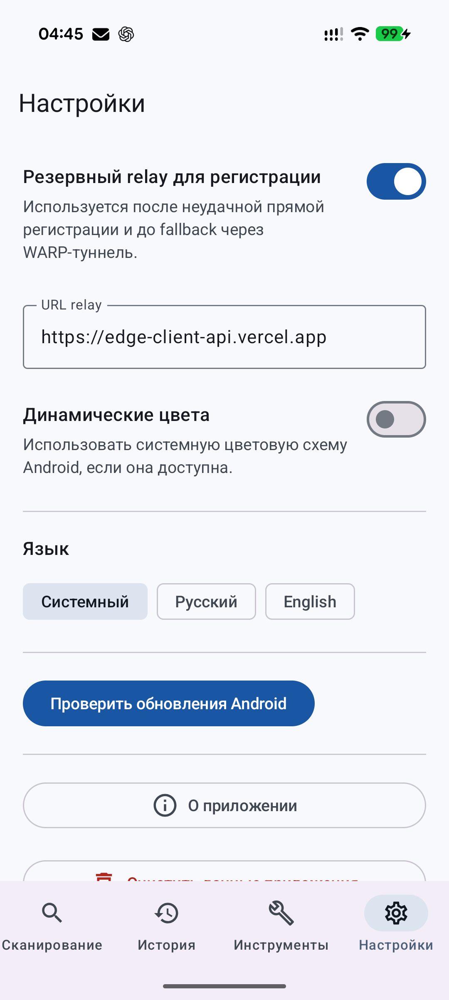</picture> | <picture><source media="(prefers-color-scheme: dark)" srcset="docs/screenshots/dark/expert.png"><source media="(prefers-color-scheme: light)" srcset="docs/screenshots/light/expert.png">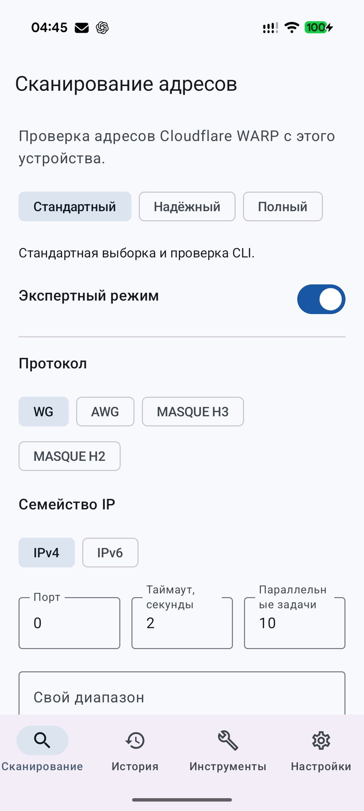</picture> |
| Процесс сканирования | Таблица: адреса и пинг |
| <picture><source media="(prefers-color-scheme: dark)" srcset="docs/screenshots/dark/progress.png"><source media="(prefers-color-scheme: light)" srcset="docs/screenshots/light/progress.png">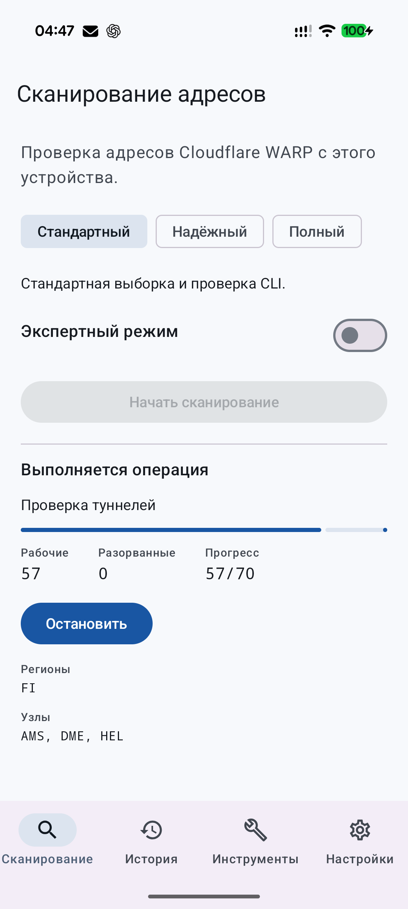</picture> | <picture><source media="(prefers-color-scheme: dark)" srcset="docs/screenshots/dark/results.png"><source media="(prefers-color-scheme: light)" srcset="docs/screenshots/light/results.png">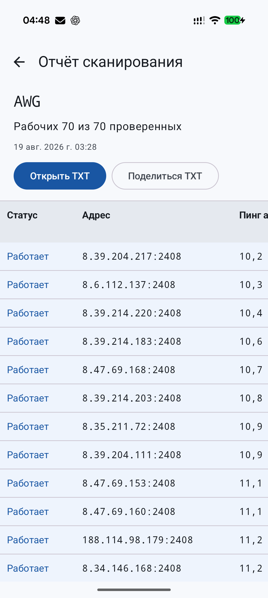</picture> |
| Таблица: регионы и узлы | Лучший адрес |
| <picture><source media="(prefers-color-scheme: dark)" srcset="docs/screenshots/dark/results-nodes.png"><source media="(prefers-color-scheme: light)" srcset="docs/screenshots/light/results-nodes.png">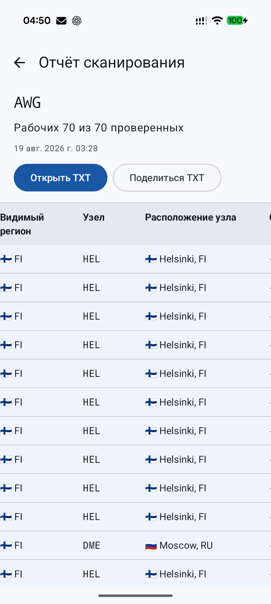</picture> | <picture><source media="(prefers-color-scheme: dark)" srcset="docs/screenshots/dark/best-endpoint.png"><source media="(prefers-color-scheme: light)" srcset="docs/screenshots/light/best-endpoint.png">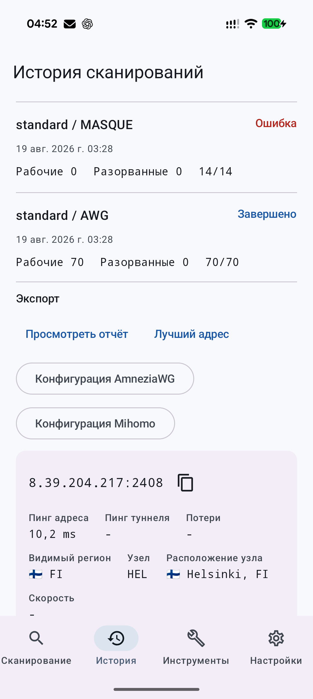</picture> |

## Установка

Скачайте APK из [Android releases](https://github.com/openwarpkit/warpscout-android/releases). Выберите файл для архитектуры устройства или universal APK.

Android-релизы используют теги вида `android-vMAJOR.MINOR.PATCH`. CLI использует upstream-теги вида `vMAJOR.MINOR.PATCH`.

## Поддерживаемые версии Android

| Параметр | Поддержка |
| --- | --- |
| Минимальная версия Android | Android 8.0, API 26 |
| Целевая версия Android | Android 17, API 37 |
| arm64-v8a | Поддерживается |
| armeabi-v7a | Поддерживается |
| x86_64 | Поддерживается |

## Разрешения и приватность

Сетевой доступ используется для регистрации, сканирования, проверки обновлений и SOCKS-трафика. Foreground Service продолжает активную операцию, когда интерфейс не открыт. На Android 13 и новее приложение может запросить разрешение на уведомления с прогрессом.

Account JSON шифруется с помощью AES-GCM и ключа из Android Keystore. Экспортируемые конфигурации создаются только по запросу и передаются из приватного кэша приложения. Секреты не записываются в Room, DataStore, логи приложения и отчёты об ошибках. История содержит параметры и результаты без данных WARP-аккаунта.

Проверка обновлений читает только релизы `openwarpkit/warpscout-android` с тегами, начинающимися на `android-v`.

## Сборка из исходного кода

Необходимые инструменты:

| Инструмент | Версия |
| --- | --- |
| Go | Версия из `go.mod` |
| JDK | 17 |
| Gradle | 9.5.0 |
| Android Gradle Plugin | 9.3.0 |
| Android SDK | API 37 |
| Android NDK | 28.2.13676358 |

Проверка Go-кода:

```sh
go test ./...
```

Сборка Go Mobile AAR на Linux или macOS:

```sh
./scripts/build-mobile.sh
```

Сборка Go Mobile AAR на Windows:

```powershell
./scripts/build-mobile.ps1
```

Сборка debug APK:

```sh
./android/gradlew -p android :app:assembleDebug
```

AAR собирается для `android/arm64`, `android/arm` и `android/amd64`. Android-проект упаковывает их как `arm64-v8a`, `armeabi-v7a` и `x86_64`.

## Выпуск релиза

Отправьте тег, например `android-v1.0.0`. Workflow определит `versionName` и `versionCode`, соберёт AAR и четыре варианта APK, подпишет APK, проверит подпись и native libraries, выполнит smoke test на x86_64 emulator, создаст контрольные суммы и provenance, затем опубликует GitHub Release.

Ключ подписи передаётся через GitHub Secrets. Ручной запуск workflow собирает неподписанный universal APK и не создаёт релиз.

## Upstream и атрибуция

WARPSCOUT for Android is an independent OpenWarpKit project based on the WARPSCOUT CLI.

Original project: https://github.com/vernette/warpscout

Original author: Nikita S. (@vernette)

This repository is not an official Android release maintained by the upstream author.

Репозиторий сохраняет исходную Git-историю и лицензию. Правила синхронизации и текущая базовая ревизия указаны в [UPSTREAM.md](UPSTREAM.md).

## Авторы и зависимости

OpenWarpKit поддерживает Android-приложение и изменения для Android. [Nikita S. (@vernette)](https://github.com/vernette) является автором оригинального WARPSCOUT CLI.

Сохранены прямые ссылки из Credits оригинального проекта:

- [Cloudflare WARP](https://one.one.one.one/)
- [puzige/CloudflareWarpSpeedTest](https://github.com/puzige/CloudflareWarpSpeedTest)
- [ampetelin/warp-endpoint-checker](https://github.com/ampetelin/warp-endpoint-checker)
- [TheyCallMeSecond/WARP-Endpoint-IP](https://github.com/TheyCallMeSecond/WARP-Endpoint-IP)
- [SagePtr/mini_quic_generator](https://github.com/SagePtr/mini_quic_generator)
- [Diniboy1123/usque](https://github.com/Diniboy1123/usque)
- [nellimonix/base-relay](https://github.com/nellimonix/base-relay)
- [amnezia-vpn/amneziawg-go](https://github.com/amnezia-vpn/amneziawg-go)
- [charmbracelet/bubbletea](https://github.com/charmbracelet/bubbletea)

Android-интеграция использует [Go Mobile](https://pkg.go.dev/golang.org/x/mobile/cmd/gomobile), [Jetpack Compose](https://developer.android.com/compose), [Hilt](https://developer.android.com/training/dependency-injection/hilt-android), [Room](https://developer.android.com/training/data-storage/room) и [DataStore](https://developer.android.com/topic/libraries/architecture/datastore).

Уведомления о распространяемых зависимостях находятся в [THIRD_PARTY_NOTICES.md](THIRD_PARTY_NOTICES.md).

## Лицензия

Проект распространяется по лицензии MIT. Исходная строка copyright Nikita S. сохранена в [LICENSE](LICENSE). OpenWarpKit является автором Android-приложения и изменений, но не оригинального CLI.
