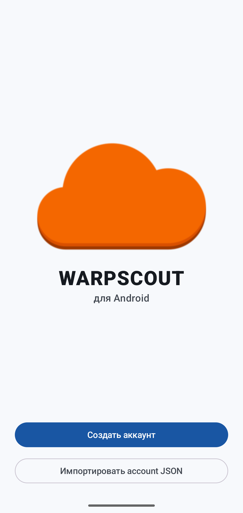
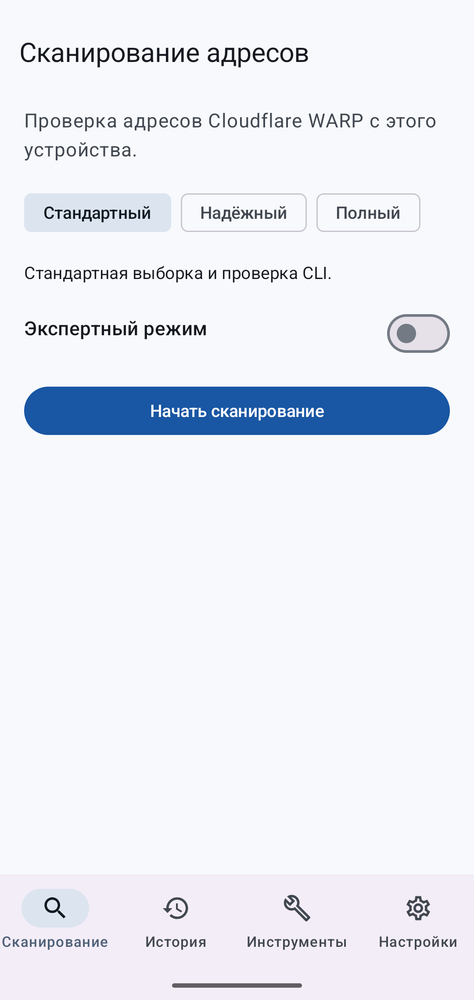
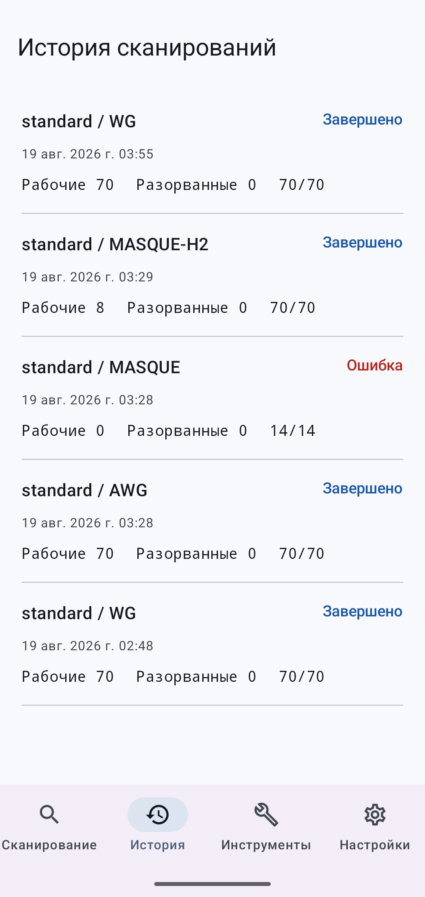
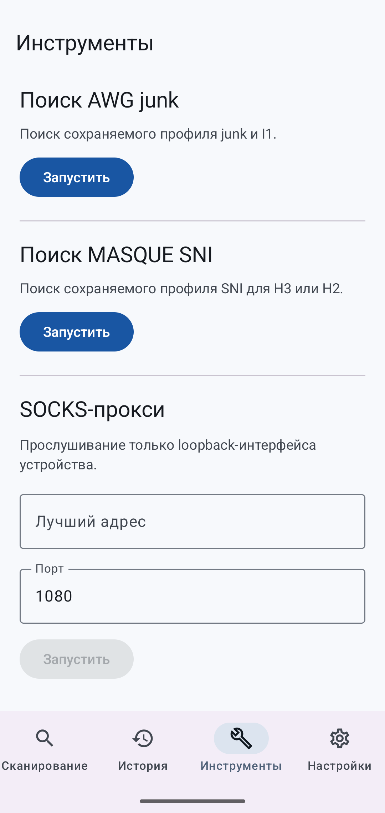
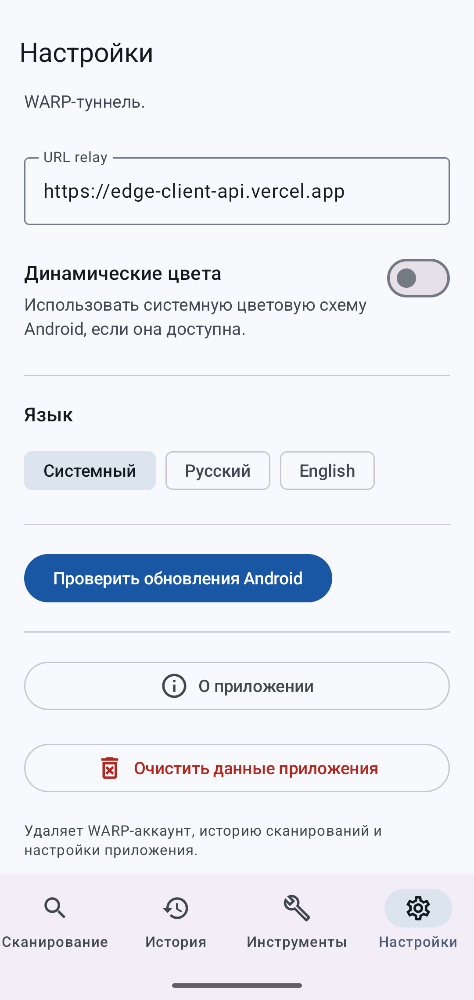
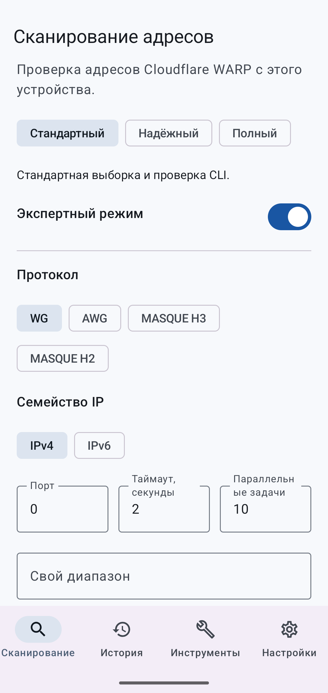
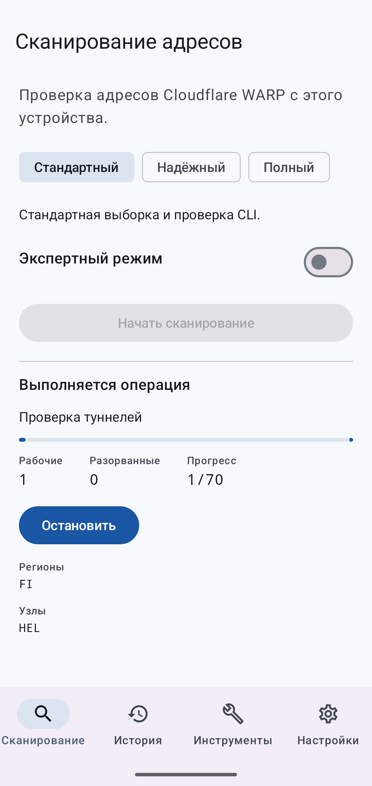
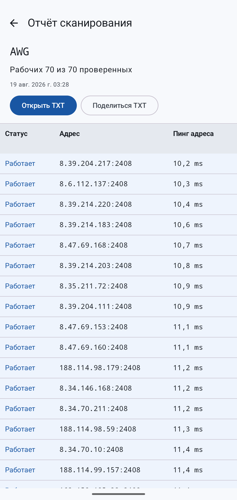
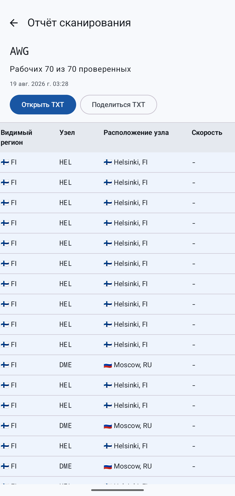
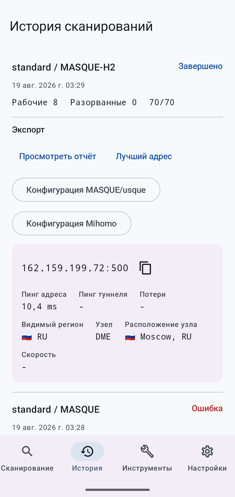

# WARPSCOUT for Android

[Русская версия](README_RU.md)

## About

WARPSCOUT for Android is a native Android interface under development for local WARP account registration, endpoint scanning, discovery tools, configuration export, and loopback SOCKS operation.

Scanning runs on the Android device. Accounts and scan results are not stored on an OpenWarpKit server.

## Features

The first Android release targets:

- Standard, Durable, and Full scan presets
- WireGuard, AmneziaWG, MASQUE H3, and MASQUE H2
- IPv4, IPv6, node filters, country filters, custom targets, MTU, DNS, and speed tests
- AWG junk and I1 discovery
- MASQUE SNI discovery
- WARP-in-WARP scans
- Scan history stored on the device
- WireGuard, AmneziaWG, usque, Mihomo, plain report, and best endpoint export
- Loopback-only SOCKS server
- English and Russian interface
- Foreground operation service with progress and stop action

## Screenshots

| Onboarding | Scan |
| --- | --- |
|  |  |
| History | Tools |
|  |  |
| Settings | Expert mode |
|  |  |
| Scan in progress | Report table: endpoints and ping |
|  |  |
| Report table: regions and nodes | Best endpoint |
|  |  |

## Installation

Download an APK from [Android releases](https://github.com/openwarpkit/warpscout-android/releases). Choose the file for the device ABI or use the universal APK.

Android releases use tags in the form `android-vMAJOR.MINOR.PATCH`. CLI tags use the upstream `vMAJOR.MINOR.PATCH` format.

## Supported Android versions

| Item | Support |
| --- | --- |
| Minimum Android version | Android 8.0, API 26 |
| Target Android version | Android 17, API 37 |
| arm64-v8a | Supported |
| armeabi-v7a | Supported |
| x86_64 | Supported |

## Permissions and privacy

The application uses network access for registration, scanning, update checks, and SOCKS traffic. A foreground service keeps an active operation running when the interface is not visible. Android 13 and later may request notification permission for foreground progress.

Account JSON is encrypted with AES-GCM using a key held by Android Keystore. Configuration exports are generated only on request and shared from application-private cache. Secrets are not written to Room, DataStore, application logs, or error reports. Scan history contains operation parameters and results without account credentials.

The update checker reads only releases from `openwarpkit/warpscout-android` whose tags start with `android-v`.

## Build from source

Required tools:

| Tool | Version |
| --- | --- |
| Go | Version from `go.mod` |
| JDK | 17 |
| Gradle | 9.5.0 |
| Android Gradle Plugin | 9.3.0 |
| Android SDK | API 37 |
| Android NDK | 28.2.13676358 |

Build and test the Go code:

```sh
go test ./...
```

Build the Go Mobile AAR on Linux or macOS:

```sh
./scripts/build-mobile.sh
```

Build the Go Mobile AAR on Windows:

```powershell
./scripts/build-mobile.ps1
```

Build the debug APK:

```sh
./android/gradlew -p android :app:assembleDebug
```

The AAR build targets `android/arm64`, `android/arm`, and `android/amd64`. The Android project packages them as `arm64-v8a`, `armeabi-v7a`, and `x86_64`.

## Release process

Push a tag such as `android-v1.0.0`. The Android release workflow derives `versionName` and `versionCode`, builds the AAR and four APK variants, signs the APKs, verifies signatures and native libraries, runs an x86_64 emulator smoke test, generates checksums and provenance, and publishes the GitHub Release.

The release signing key is supplied through GitHub Secrets. A manual workflow run builds an unsigned universal APK and does not create a release.

## Upstream and attribution

WARPSCOUT for Android is an independent OpenWarpKit project based on the WARPSCOUT CLI.

Original project: https://github.com/vernette/warpscout

Original author: Nikita S. (@vernette)

This repository is not an official Android release maintained by the upstream author.

The repository preserves the original Git history and license. Upstream synchronization rules and the current base revision are recorded in [UPSTREAM.md](UPSTREAM.md).

## Credits

OpenWarpKit maintains the Android application and Android-specific changes. [Nikita S. (@vernette)](https://github.com/vernette) is the author of the original WARPSCOUT CLI.

Original WARPSCOUT credits are preserved with direct links:

- [Cloudflare WARP](https://one.one.one.one/)
- [puzige/CloudflareWarpSpeedTest](https://github.com/puzige/CloudflareWarpSpeedTest)
- [ampetelin/warp-endpoint-checker](https://github.com/ampetelin/warp-endpoint-checker)
- [TheyCallMeSecond/WARP-Endpoint-IP](https://github.com/TheyCallMeSecond/WARP-Endpoint-IP)
- [SagePtr/mini_quic_generator](https://github.com/SagePtr/mini_quic_generator)
- [Diniboy1123/usque](https://github.com/Diniboy1123/usque)
- [nellimonix/base-relay](https://github.com/nellimonix/base-relay)
- [amnezia-vpn/amneziawg-go](https://github.com/amnezia-vpn/amneziawg-go)
- [charmbracelet/bubbletea](https://github.com/charmbracelet/bubbletea)

Android integration uses [Go Mobile](https://pkg.go.dev/golang.org/x/mobile/cmd/gomobile), [Jetpack Compose](https://developer.android.com/compose), [Hilt](https://developer.android.com/training/dependency-injection/hilt-android), [Room](https://developer.android.com/training/data-storage/room), and [DataStore](https://developer.android.com/topic/libraries/architecture/datastore).

See [THIRD_PARTY_NOTICES.md](THIRD_PARTY_NOTICES.md) for distributed dependency notices.

## License

The project is distributed under the MIT License. The original copyright notice for Nikita S. is preserved in [LICENSE](LICENSE). OpenWarpKit authors the Android application and changes, not the original CLI.
